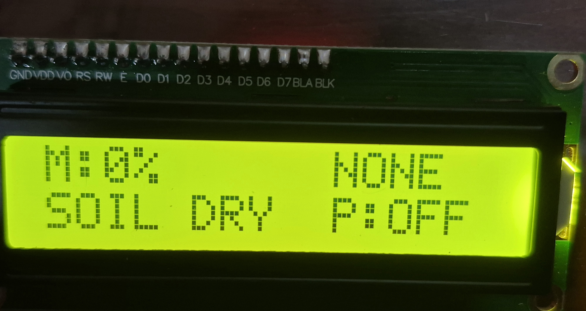
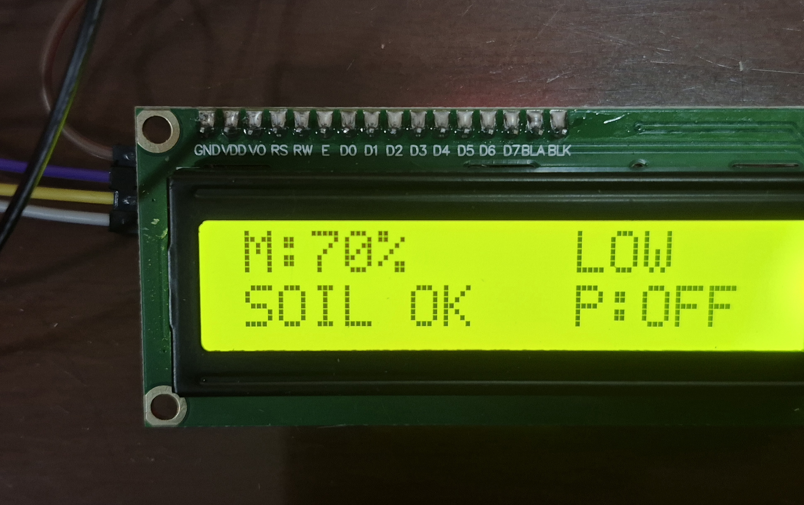
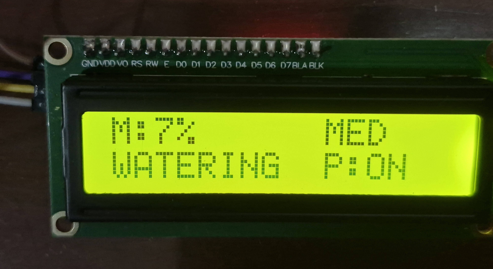
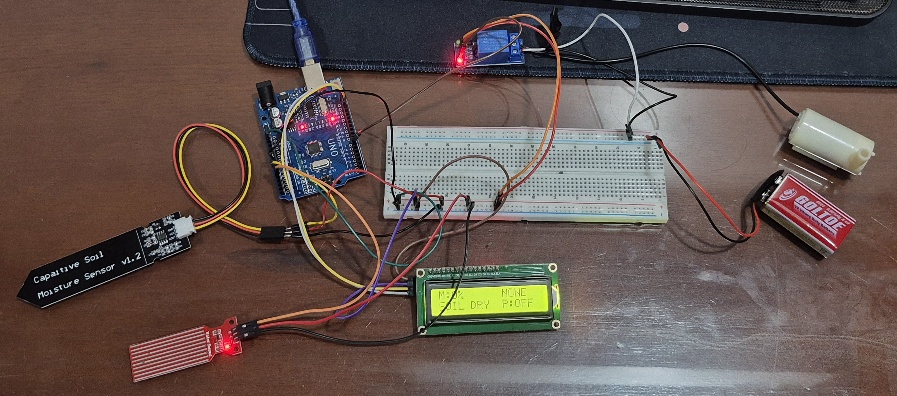
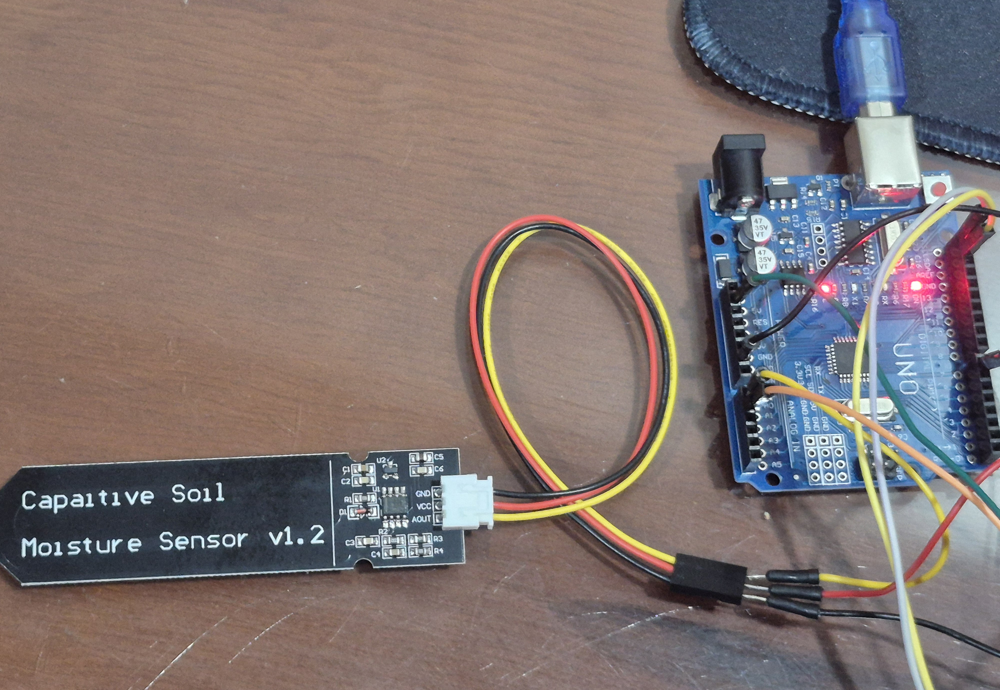
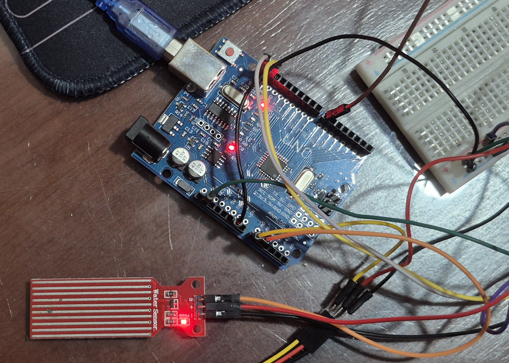

# Smart Plant Watering System 

An automatic plant watering system built with Arduino Uno.

The system continuously monitors soil moisture and water tank level, then automatically activates a water pump when the soil becomes dry. A 16x2 LCD provides real-time feedback on moisture level, water status, and pump operation.

---

## Features

* Automatic plant watering
* Soil moisture monitoring
* Water level monitoring
* LCD1602 I2C user interface
* Relay-controlled water pump
* Dry-run protection
* Hysteresis control for stable operation

---

## Components

| Component              | Quantity |
| ---------------------- | -------- |
| Arduino Uno R3         | 1        |
| LCD1602 I2C            | 1        |
| Soil Moisture Sensor   | 1        |
| Water Level Sensor     | 1        |
| 1-Channel Relay Module | 1        |
| DC Water Pump (3–6V)   | 1        |
| Silicone Tube          | 1        |
| Breadboard             | 1        |
| Jumper Wires           | Several  |

---

## System Logic

### Pump ON

The pump starts when:

* Soil moisture < 30%
* Water level is sufficient

### Pump OFF

The pump stops when:

* Soil moisture > 45%
* Water level is below the safety threshold

This hysteresis-based design prevents rapid relay switching and improves system stability.

---

## Water Level Status

| Status | Sensor Value |
| ------ | ------------ |
| NONE   | < 400        |
| LOW    | 400 - 599    |
| MED    | 600 - 659    |
| HIGH   | ≥ 660        |

---

## Pin Connections

| Device               | Arduino Pin |
| -------------------- | ----------- |
| Soil Moisture Sensor | A0          |
| Water Level Sensor   | A1          |
| Relay IN             | D7          |
| LCD SDA              | A4          |
| LCD SCL              | A5          |

---

## LCD Display States

### Startup

### Normal Operation

### Watering Mode

---

## Project Photos

### Full System Overview

### Soil Moisture Sensor

### Water Level Sensor

---

## Future Improvements

* ESP32 WiFi Dashboard
* Mobile monitoring
* Temperature and humidity sensing
* Cloud data logging
* Push notifications
* Solar-powered operation

---

## Author

Pham Bao Quan

---

## License

This project is licensed under the MIT License.
